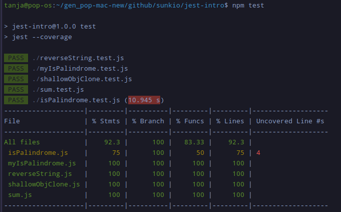

# Intro to Testing with Jest
This repository contains some code-along as well as extra "play around" code for the [Jest Introduction course by Dave Gray](https://www.youtube.com/watch?v=x6NUZ8dc9Qg), available for free on Youtube.
This course uses JavaScript.

## Table of Contents
- [Info](#info)
- [Coverage Directory](#coverage-directory---to-git-or-not-to-git)
- [Contributing](#contributing)
- [Resources](#resources)
- [License](#license)
- [Support](#support)

## Info
- Jest was originally developed by Facebook and is still maintained by Meta.

- To get started, initialize an empty npm project:
  ```bash
  npm init -y
  ```
  Then install Jest as a dev-dependency:
  ``` bash
  npm i jest -D
  ```


- Unit Test: tests the smallest unit in isolation 
  => see: sum.js/sum.test.js - the function does one thing, the test tests this unit

- Test Suite: all the tests in one file

- In package.json add `--coverage` to the jest test in scripts - to get a full report and see if all code has been covered by tests:
  ```JSON
    "scripts": {
      "test": "jest --coverage"
    },
  ```
  
  The output looks like this:

  

  
  - Stmts = Statements
  - The result shows that the following from isPalindrome.js has not been tested:
    - 1 out of 4 statements
    - 1 out of 2 functions
    - 4 out of 11 lines (3 actual lines of code and one empty line)

# Coverage Directory - to git or not to git
Here's what ChatGPT things about committing the coverage directory, that is created when you run jest with the --coverage flag, to git: 

Whether you should commit the coverage directory to Git and push it to GitHub depends on your project's specific needs and your team's development practices. Here are some considerations to help you decide:

Reasons to commit and push the coverage directory:

- Documentation and Reporting: Including the coverage directory in your repository can be helpful for documentation and reporting purposes. It allows you to easily share and view code coverage reports with your team or stakeholders on GitHub.

- Historical Data: Storing historical code coverage data in your repository can be valuable for tracking changes in code coverage over time. This can help identify trends and improvements in your testing efforts.

- Collaboration: If you're working with a team of developers, having the coverage data in the repository ensures that everyone has access to the same data. This can facilitate discussions about test coverage and code quality.

- Continuous Integration: Some CI/CD pipelines may rely on the coverage data to make decisions about whether to deploy code changes. In such cases, having the data in the repository is essential.

Reasons to exclude the coverage directory:

- Size: Coverage reports can become quite large, especially for larger projects. Including them in the repository can bloat the repository size, which may not be desirable, especially if the coverage data changes frequently.

- Irrelevant for Contributors: Developers contributing to your project may not need the coverage data. It can be considered noise in the repository and may distract from the main codebase.

- Security: In some cases, code coverage reports may contain sensitive information or paths that you don't want to expose publicly.

If you choose to include the coverage directory, make sure to update your .gitignore file to exclude any generated or temporary files that don't need to be stored in the repository. For example, you can add a line like this to your .gitignore file:

```plaintext
/coverage/
```
This will prevent the coverage directory from being accidentally committed if you choose to include it. However, if you do decide to include it, ensure that it doesn't contain any sensitive information.

Ultimately, the decision to include or exclude the coverage directory should be based on your project's specific needs and the preferences of your team. It's a good practice to have a discussion with your team members and document your decision in your project's development guidelines or README.md file so that everyone is on the same page.

## Contributing
Contributions are welcome! If you'd like to contribute to this project or have suggestions, please open an issue or submit a pull request. Please follow the [Code of Conduct](./CODE_OF_CONDUCT.md) when contributing.

To submit a pull request:

1. [Fork](https://docs.github.com/en/get-started/quickstart/fork-a-repo) the repository.
2. Create your feature branch: `git checkout -b feature/<your-feature-name>`
3. Commit your changes: `git commit -am '<Add some feature>'`
4. Push to the branch: `git push origin feature/<your-feature-name>`
5. Create a new Pull Request.

## Resources
- Jest docs: https://jestjs.io/docs/getting-started
- Dave's course: https://www.youtube.com/watch?v=x6NUZ8dc9Qg

## License
This project is open-source and available under the [MIT License](./LICENSE.md).

## Support
If you have any questions or need assistance, feel free to open an issue in the repository or reach out to me via email at: hello@tanjaschmidt.com.
